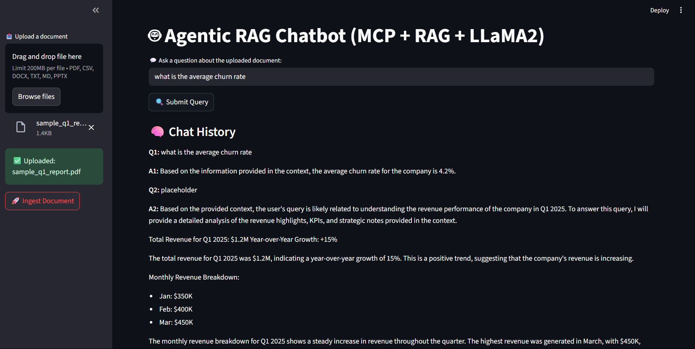

# 🤖 Agentic RAG Chatbot with MCP + LLaMA2

An intelligent document-based chatbot that leverages a multi-agent architecture using **MCP (Message Communication Protocol)** and **Retrieval-Augmented Generation (RAG)**. Powered by **LLaMA2 via Ollama**, this app allows users to upload a document and ask questions, with context-aware responses and memory via ChromaDB.

> Built with ❤️ using Streamlit, Sentence Transformers, Ollama, and a clean agent-based system.

---

## 🧠 Architecture Flow


##🛠️ Tech Stack

Frontend: Streamlit

LLM: LLaMA2 via Ollama

Embedding: Sentence Transformers (all-MiniLM-L6-v2)

Vector DB: ChromaDB

Orchestration: MCP-style message passing with agent isolation




1. Clone the Repo
```
git clone https://github.com/yourusername/agentic-rag-chatbot.git
cd agentic-rag-chatbot
```

2. Create & Activate Virtual Environment
```
python -m venv venv
source venv/bin/activate  # Linux/macOS
venv\Scripts\activate     # Windows
```
3. Install Dependencies
```
pip install -r requirements.txt
```
4. Run Ollama (ensure 8GB+ RAM available)
```
ollama run llama2
```
5. Start the App
```
streamlit run app.py
```
